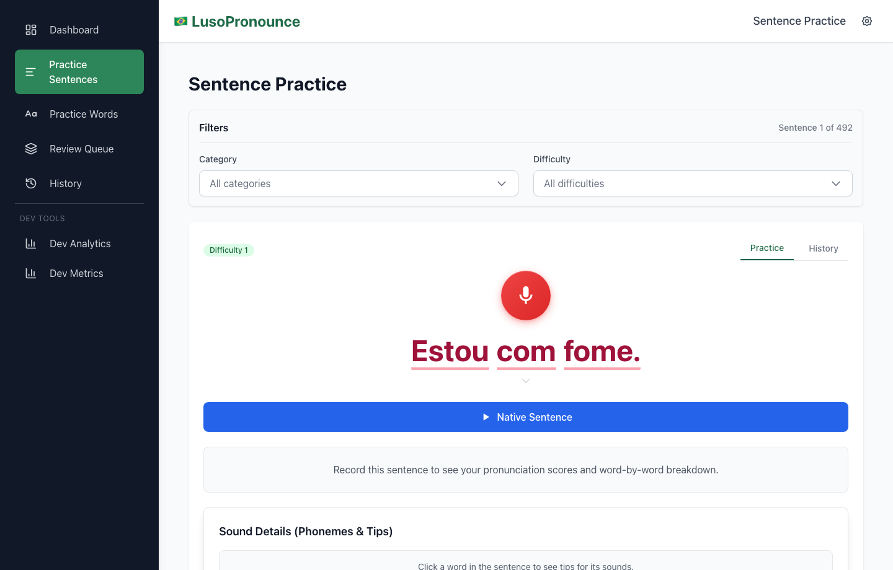
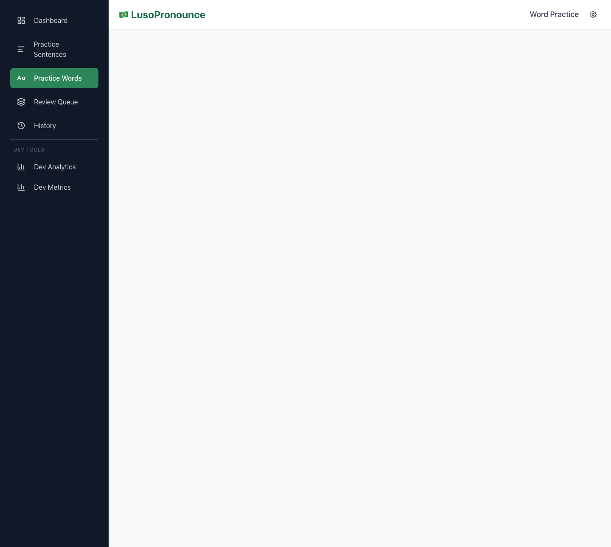
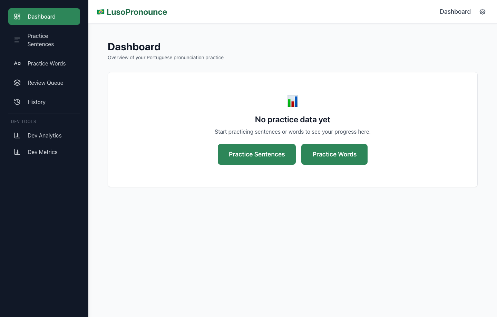
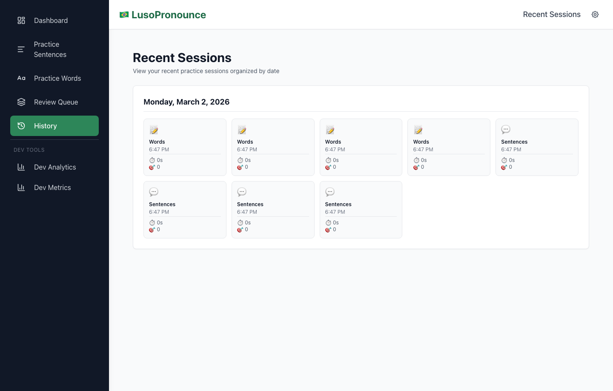
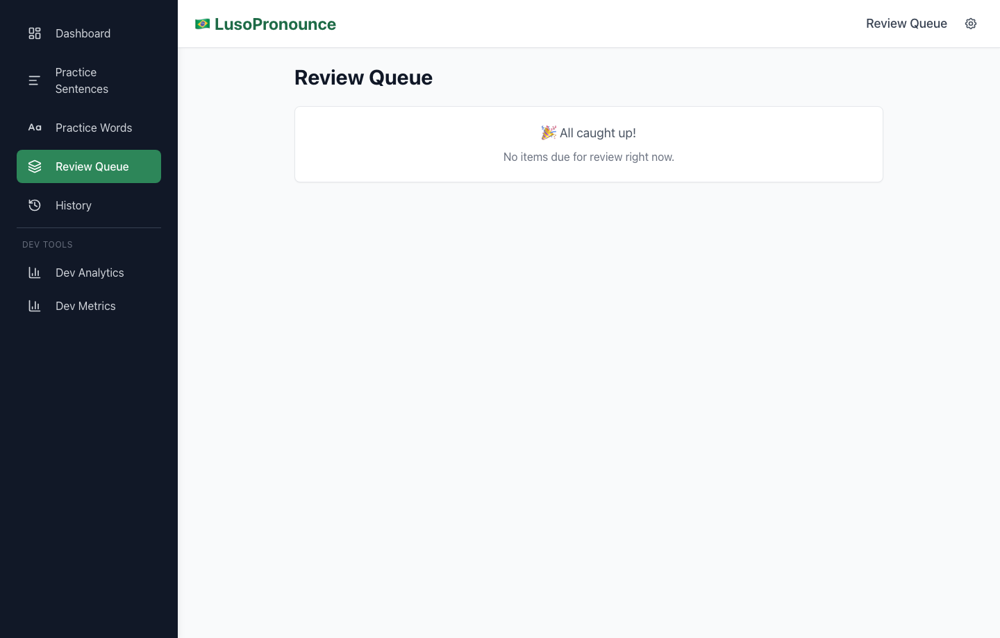

# LusoPronounce

A browser-based Brazilian Portuguese pronunciation trainer that scores your speech word-by-word using Azure Speech Service and coaches you with targeted minimal-pair drills.

<!-- TODO: Replace this static hero with a short GIF showing a full record → score → coaching cycle -->


## Why this project exists

English speakers learning Brazilian Portuguese rarely get fast, phoneme-level feedback. Most apps grade at the sentence level and miss the sound confusions that matter most in PT-BR: nasalization, `r`/`rr`, `lh`/`nh`, `tch`/`ti`, open vs. close vowels. LusoPronounce closes that loop — record a sentence, get per-word and per-phoneme scores in seconds, and receive deterministic coaching on what to drill next.

## What it does

- Record a sentence or word in the browser and get back word-by-word accuracy, fluency, completeness, and prosody scores
- Expand any word to see phoneme-level breakdowns with IPA and error-type tags
- Surface actionable coaching suggestions after each attempt, including minimal-pair drills tuned to the learner's confusion patterns
- Track progress via a spaced-repetition queue, weak-phoneme analysis, and a 7-day performance dashboard

See [`FEATURES.md`](./FEATURES.md) for the full user-facing feature list.

## Tech stack

- **Frontend** — React 19 + TypeScript 5.9, Vite 7, Tailwind CSS 3.4, React Router 7
- **Backend** — Express 5 on Node 22, Mongoose 9 for MongoDB, JWT auth with optional invite-code gating
- **Speech** — Microsoft Cognitive Services Speech SDK (pronunciation assessment, TTS)
- **Testing** — Vitest 4 (unit + contract) + Playwright 1.58 (e2e)
- **Deployment** — Railway (multi-stage Dockerfile on `node:22-slim`)

## Architecture overview

```
Browser (MediaRecorder, webm/opus)
        │
        ▼
Vite dev proxy  ──►  Express /api/pronunciation/assessment
                              │
                              ▼
                      ffmpeg transcode (WAV 16 kHz mono)
                              │
                              ▼
                      Azure Speech SDK  ──►  word + phoneme scores
                              │
                              ▼
                      Coaching engine  ──►  React UI (hooks + context)
```

Deeper architecture notes live in [`docs/architecture/`](./docs/architecture).

## Repository structure

```text
luso-pronounce/
├── src/                        # Application source (frontend + backend share one src tree)
│   ├── app/                    # React root (App.tsx, main.tsx)
│   ├── pages/                  # Page-level route components
│   │   └── dev/                # Dev-only lazy-loaded pages (fixtures, metrics, analytics)
│   ├── components/             # Reusable React components (feature-grouped)
│   │   ├── auth/               # Auth form, route guards
│   │   ├── common/             # Generic UI primitives (buttons, panels, spinners, charts)
│   │   ├── dashboard/          # Dashboard-specific widgets
│   │   ├── layout/             # Shell components (AppLayout, Sidebar, Header)
│   │   ├── practice/           # Sentence/word practice UI
│   │   └── pronunciation/      # Scoring, phoneme panels, word chips, sparklines
│   ├── features/               # Cross-cutting feature modules (e.g. localStorage migration)
│   ├── hooks/                  # Recording, assessment, audio playback hooks
│   ├── state/                  # React Context stores (settings, progress, practice log)
│   ├── lib/                    # Domain logic (audio quality, coaching, analytics, parsing, data loader)
│   │   └── coaching/           # Coaching engine, confusion detection, PT-BR minimal pairs
│   ├── api/                    # Client-side API modules (auth, practice, flashcards)
│   ├── models/                 # Frontend data models (appData, audio, content, practice, progress, vocab)
│   ├── pipeline/               # Content generation pipeline logic (enrich, phoneme map, TTS, validate)
│   ├── config/                 # App runtime configuration (appConfig.ts)
│   ├── shared/types/           # Types shared between client and server
│   ├── types/                  # Client-only TypeScript types
│   ├── utils/                  # Small utilities (audio routing, difficulty labels, drill log)
│   ├── styles/                 # Global CSS (Tailwind entry)
│   ├── dev/                    # Dev-only utilities (e2e media mocks)
│   ├── mock/                   # Static fixtures for unit/UI tests
│   ├── test/                   # Cross-cutting tests + setupTests.ts
│   └── server/                 # Express backend
│       ├── app.ts              # Server entry point
│       ├── routes/             # /api route handlers
│       ├── middleware/         # auth, rate limiting, CORS + Helmet
│       ├── models/             # Mongoose schemas
│       ├── services/           # Business logic (e.g. SM-2 flashcard scheduler)
│       ├── mappers/            # DTO mappers
│       ├── lib/                # Audio conversion, temp workspace, timing
│       ├── config/             # Startup env validation
│       ├── db/                 # MongoDB singleton
│       ├── utils/              # speechDebug, etc.
│       └── __fixtures__/       # Server-side test audio
│
├── data/                       # Static + generated datasets
│   ├── masterSentences.json    # Canonical enriched sentence corpus (runtime)
│   ├── masterWords.json        # Canonical enriched word corpus (runtime)
│   ├── audio_index.json        # audioId → file path map
│   ├── phoneme_metadata.json   # Canonical phoneme metadata (IPA, tips, minimal pairs)
│   ├── sentences.json          # Source sentence list (pre-enrichment)
│   ├── word_practice_synthetic.json
│   ├── sentence_expansions/    # Phase-5 sentence batches
│   ├── raw/                    # Upstream generator output (Gemini CSV)
│   ├── static/                 # Legacy hand-curated source lists (words.json, sentences.json)
│   ├── test_data/              # Fixed recordings + JSON fixtures for offline testing
│   ├── debug/                  # Runtime Azure debug samples (gitignored)
│   └── legacy/                 # Historical/deprecated data kept for reference
│
├── audio/                      # Non-web-served source audio (ptbr/male, ptbr/female)
├── public/                     # Web-served static assets (audio/, index.html assets)
│   └── audio/                  # Published sentence + word audio served at /audio/*
│
├── scripts/                    # Data + audio generation and operational scripts
│   ├── legacy/                 # Retired scripts kept for historical reference
│   └── README.md               # Script usage notes
│
├── config/                     # Root-level pipeline configuration
│   └── generationPipeline.config.ts
│
├── e2e/                        # Playwright end-to-end tests (phase-organized)
├── docs/                       # Documentation
│   ├── architecture/           # UI architecture, routes, audio pipeline, perf, testing
│   ├── audits/                 # Deployment / security / mobile audit reports
│   ├── planning/               # Roadmap, backlog, feature plans, TODOs
│   ├── retrospectives/         # Post-phase write-ups
│   ├── dev-tools/              # Standalone dev utilities (e.g. audio-check.html)
│   └── assets/                 # Screenshots used in README / docs
│
├── .github/workflows/          # CI pipelines
├── Dockerfile                  # Multi-stage production image
├── railway.json / nixpacks.toml
├── playwright.config.ts
├── vite.config.ts              # Frontend + path alias @ → src
├── vitest.config.ts
├── tsconfig.json
├── tailwind.config.js / postcss.config.js
├── package.json
├── requirements.txt            # Python deps for upstream Gemini generator
├── FEATURES.md                 # User-facing feature list (kept in sync with code)
├── CLAUDE.md                   # Agent / contributor instructions
└── README.md
```

### What each major folder is for

| Folder | Purpose |
| --- | --- |
| `src/app` | React entry point and root routing shell |
| `src/pages` | Top-level route components (practice pages, auth, dashboard) |
| `src/components` | Feature-grouped presentational and container components |
| `src/features` | Cross-cutting feature modules that don't fit under a single page |
| `src/hooks` | Reusable business-logic hooks (recording, assessment lifecycle, audio playback) |
| `src/state` | React Context stores for global app state |
| `src/lib` | Pure domain logic: audio quality gates, pronunciation parsing, coaching engine, analytics |
| `src/api` | Client-side HTTP wrappers |
| `src/pipeline` | Content generation pipeline (used by `npm run generation:pipeline`) |
| `src/shared/types` | Types shared across client and server |
| `src/server` | Express backend: routes, middleware, Mongoose models, services |
| `data/` | Static corpora, generated master datasets, test fixtures, debug dumps |
| `audio/` | Source-of-truth WAV assets produced by the generation scripts |
| `public/audio/` | Audio copies served over HTTP |
| `scripts/` | Data/audio generation, analysis, and ops scripts |
| `e2e/` | Playwright specs, organized by phase |
| `docs/` | Documentation, organized by purpose (architecture / audits / planning / retrospectives) |

## Local setup

Requires Node 22.x.

```bash
npm install
cp .env.example .env       # fill in the values listed below
npm run dev                # frontend on http://localhost:3000
npm run dev:server         # backend  on http://localhost:4000
```

The Vite dev server proxies `/api` requests to the backend automatically.

### Common commands

```bash
npm test -- --run          # run all unit + contract tests once
npm run test:phase04       # deploy-critical unit suite
npm run verify:phase04     # unit tests + Playwright e2e
npm run build              # typecheck + production build
npm run screenshots:readme # regenerate the PNGs in docs/assets/readme/
```

### Data/audio generation

```bash
npm run generation:pipeline       # full master dataset + audio pipeline
npm run generate:audio            # legacy audio generator
npm run audio:words               # word-level TTS generation (male + female)
npm run audit:dataset             # dataset readiness report
npm run generate:sentences:stage0 # Gemini CSV → normalized sentences.json
```

## Environment variables

Copy `.env.example` to `.env` and set the required values.

**Required**

| Variable              | Purpose                                             |
|-----------------------|-----------------------------------------------------|
| `AZURE_SPEECH_KEY`    | Azure Cognitive Services Speech subscription key    |
| `AZURE_SPEECH_REGION` | Azure region (e.g. `eastus`, `brazilsouth`)         |
| `MONGODB_URI`         | MongoDB connection string (Atlas or local)          |
| `JWT_SECRET`          | Secret for signing JWT auth tokens                  |

**Optional**

| Variable                                         | Purpose                                               |
|--------------------------------------------------|-------------------------------------------------------|
| `REQUIRE_INVITE_CODE`                            | Gate registration behind an invite code (default off) |
| `GITHUB_CLIENT_ID` / `GITHUB_CLIENT_SECRET`      | GitHub OAuth                                          |
| `LINKEDIN_CLIENT_ID` / `LINKEDIN_CLIENT_SECRET`  | LinkedIn OAuth                                        |
| `APP_ORIGIN`                                     | Public URL used for OAuth redirects                   |
| `SPEECH_RATE_LIMIT_*`, `SPEECH_MAX_UPLOAD_BYTES` | Tune rate limits and upload cap                       |
| `AUDIO_CONVERT_TIMEOUT_MS`                       | ffmpeg timeout (default 12 s)                         |

See [`.env.example`](./.env.example) for the full list.

## Deployment

Target platform: **Railway**. Railway auto-detects Node and sets `PORT`.

```bash
npm run build
npm start
```

For a gated launch, seed at least one invite code before going live:

```bash
npm run invite:seed -- --code=LAUNCH-ACCESS --maxUses=25
```

Set `REQUIRE_INVITE_CODE=false` in the deployed environment for open signup.

Deployment readiness notes and audits live in [`docs/audits/`](./docs/audits).

## Port configuration

| Service                       | Port |
|-------------------------------|------|
| Vite frontend (dev)           | 3000 |
| Express backend               | 4000 |
| Playwright e2e (Vite)         | 4173 |

## Screenshots

<!-- TODO: Refresh screenshots via `npm run screenshots:readme` if the UI has changed -->

| | |
|---|---|
| **Sentence Practice** | **Word Practice** |
|  |  |
| **Dashboard** | **Recent Sessions** |
|  |  |
| **Review Queue** | |
|  | |

## Limitations

- CEFR-level estimation is not yet wired up (`src/lib/practiceAnalytics.ts` TODO)
- Pass threshold is currently hardcoded at 70 inside the card components
- Audio uploads are capped at 10 MB (tunable via `SPEECH_MAX_UPLOAD_BYTES`)
- No true offline mode — sessions dual-write to `localStorage` for resilience, but Azure assessment requires connectivity
- Azure Speech Service costs scale with usage; there is no bundled on-device fallback

## Future work

- Virtual scrolling for lists over ~500 items (see [`docs/architecture/performance-notes.md`](./docs/architecture/performance-notes.md))
- IndexedDB-backed storage for larger datasets
- Service worker for offline practice of previously fetched content
- Configurable per-user pass thresholds
- Deeper phoneme-score extraction from Azure's raw response
- CEFR-level auto-estimation from aggregate scores

## Contributing

Contributor and agent instructions live in [`CLAUDE.md`](./CLAUDE.md). Keep [`FEATURES.md`](./FEATURES.md) in sync when adding, renaming, or removing user-facing functionality.
