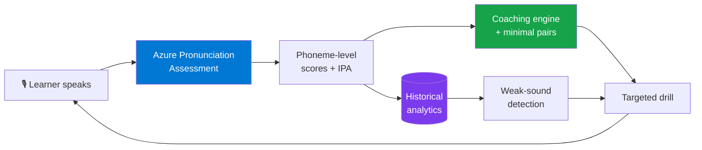
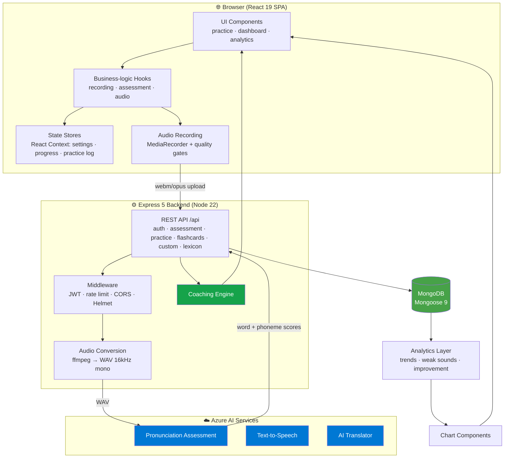
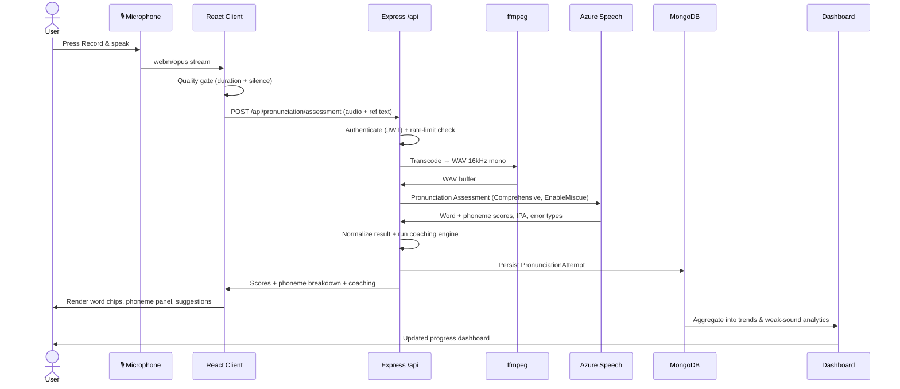
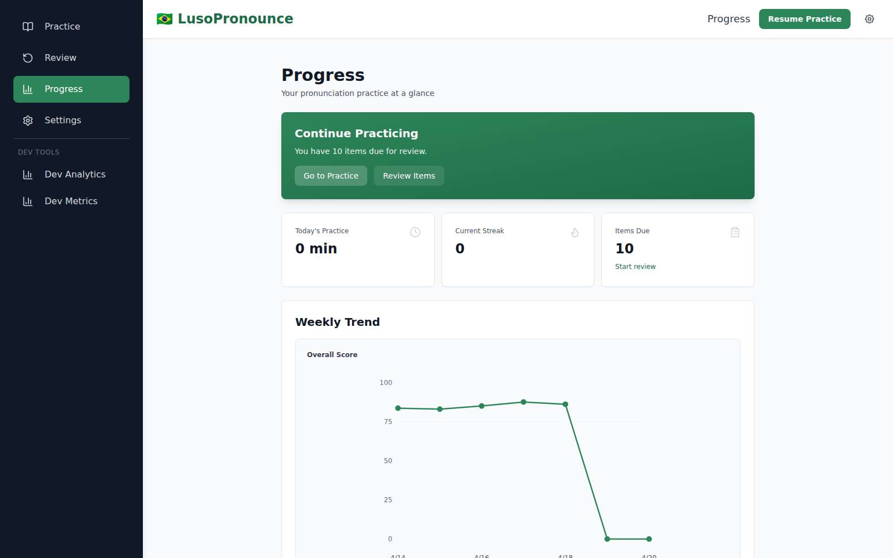
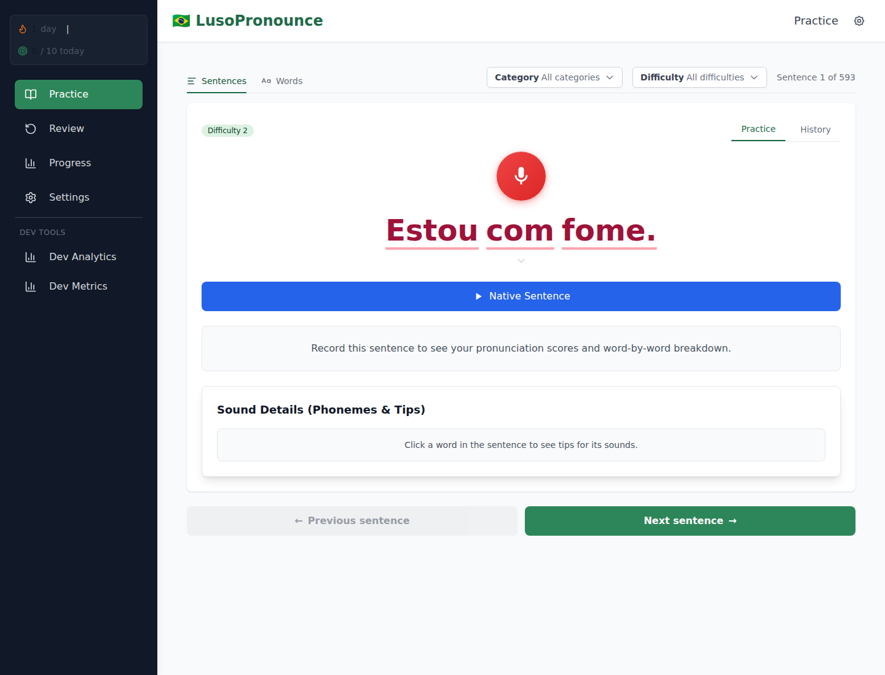
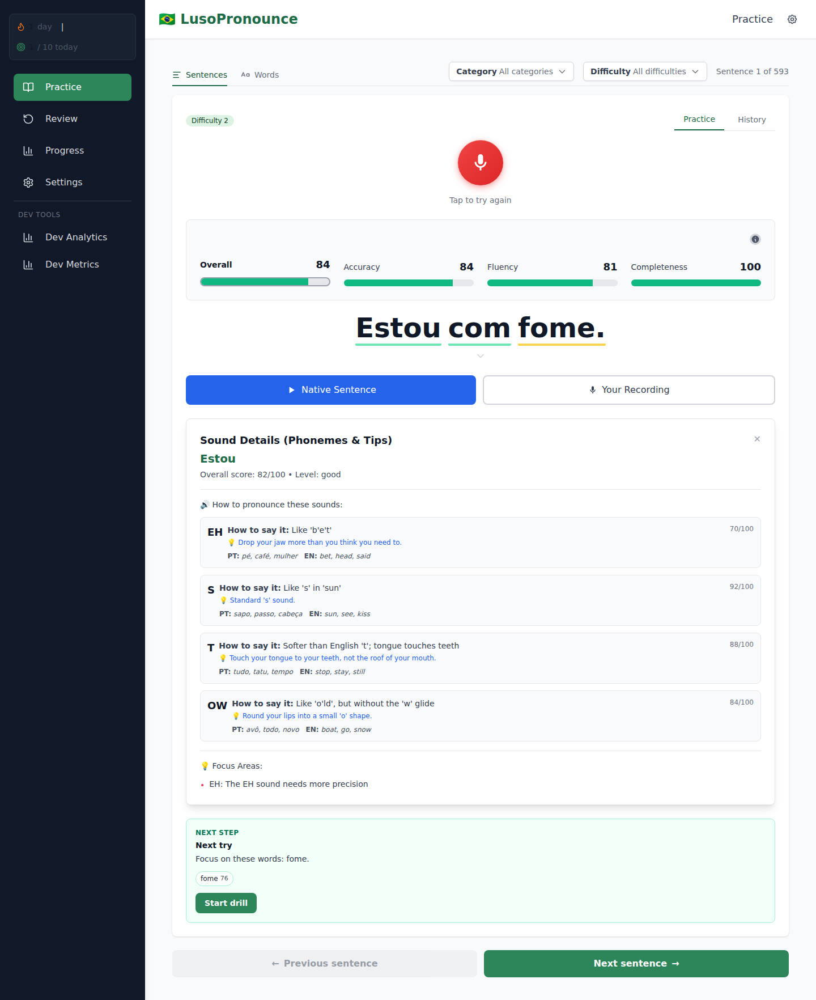

<div align="center">

# 🇧🇷 LusoPronounce

### AI-powered Brazilian Portuguese pronunciation training using Azure Speech AI — with phoneme-level feedback, deterministic coaching, and personalized progress analytics.

<br/>

[](https://react.dev/)
[](https://www.typescriptlang.org/)
[](https://vitejs.dev/)
[](https://nodejs.org/)
[](https://expressjs.com/)
[](https://azure.microsoft.com/en-us/products/ai-services/ai-speech)
[](https://www.mongodb.com/)
[](https://tailwindcss.com/)

[](./Dockerfile)
[](./.github/workflows/ci.yml)
[](#-testing)
[](https://github.com/TGALLOWAY1/LusoPronunciation/commits)
[](https://github.com/TGALLOWAY1/LusoPronunciation/releases)


<br/>

**Record a sentence → get word-by-word and phoneme-level scores in seconds → drill the exact sounds you're getting wrong.**

<!-- TODO: Replace this static hero with a short GIF showing a full record → score → coaching cycle -->


</div>

---

## 📑 Table of Contents

- [The Problem](#-the-problem)
- [Why This Project Is Technically Interesting](#-why-this-project-is-technically-interesting)
- [Project Overview](#-project-overview)
- [Core Features](#-core-features)
- [Application Architecture](#-application-architecture)
- [Pronunciation Workflow](#-pronunciation-workflow)
- [Speech AI Pipeline](#-speech-ai-pipeline)
- [AI Features](#-ai-features)
- [Analytics Dashboard](#-analytics-dashboard)
- [Repository Structure](#-repository-structure)
- [Technical Highlights](#-technical-highlights)
- [Engineering Metrics](#-engineering-metrics)
- [Getting Started](#-getting-started)
- [Screenshots](#-screenshots)
- [Design Decisions](#-design-decisions)
- [Roadmap](#-roadmap)
- [Documentation](#-documentation)
- [Contributing](#-contributing)

---

## 🎯 The Problem

> **English speakers learning Brazilian Portuguese rarely get fast, phoneme-level feedback.**

Most language apps grade pronunciation at the *sentence* level — a single green checkmark or a vague "try again." That hides the sound confusions that actually matter in PT-BR:

| Confusion | Example | Why it's hard for English speakers |
|-----------|---------|------------------------------------|
| Nasal vowels | **pão**, **mãe**, **bem** | No direct English equivalent |
| `r` vs `rr` | **caro** vs **carro** | Tap vs. guttural/aspirated |
| `lh` / `nh` | **trabalho**, **ninho** | Palatalized consonants |
| `tch` / `ti` | **tia**, **noite** | Palatalization before front vowels |
| Open vs. close vowels | **avô** vs **avó** | Meaning-changing vowel height |

**LusoPronounce closes that feedback loop.** Record a sentence, get per-word *and* per-phoneme scores in seconds, then receive **deterministic, data-grounded coaching** on exactly what to drill next — including minimal-pair drills tuned to *your* confusion patterns.

---

## 💡 Why This Project Is Technically Interesting

A recruiter-skimmable tour of the engineering. Every row maps a user-facing capability to the system design behind it.

| Capability | Why It Matters | Technologies |
|------------|----------------|--------------|
| **Azure Pronunciation Assessment** | Integrates a production cloud AI service with comprehensive scoring (accuracy, fluency, completeness, miscue) — not a toy ML demo | Azure Speech SDK, `PronunciationAssessmentConfig` |
| **Phoneme-level scoring** | Parses and normalizes Azure's nested word→phoneme response into a typed UI model with IPA + error tags | TypeScript, custom result normalizer |
| **Server-side audio preprocessing** | Browser audio (webm/opus) is transcoded to the exact format Azure requires (WAV 16 kHz, 16-bit, mono) before assessment | ffmpeg-static, Express upload pipeline |
| **Real-time browser recording** | Captures microphone audio with quality gates (min duration + RMS silence detection) before spending an API call | MediaRecorder API, Web Audio analysis |
| **AI-powered coaching engine** | Deterministic, testable rules turn raw scores into prioritized next steps + minimal-pair drills | Pure TS domain logic, fully unit-tested |
| **Pronunciation analytics** | Aggregates historical attempts into trends, weak-sound detection, and improvement tracking | Custom analytics layer + chart components |
| **Custom sentence builder** | English → PT-BR translation + on-demand TTS + per-word pronunciation coverage scoring | Azure AI Translator, Azure TTS |
| **Spaced repetition (SRS)** | Server-side SM-2 scheduler links flashcard outcomes to real pronunciation scores | Custom SM-2 implementation, Mongoose |
| **Type-safe full-stack** | Shared types across client/server; strict TS (`noUnusedLocals`/`noUnusedParameters`) | TypeScript 5.9 strict mode, shared types module |
| **Fail-fast, observable backend** | Refuses to bind the port with missing config; `/api/health` reports Mongo + Azure state | Express middleware, startup checks |
| **Security hardening** | JWT auth, per-user rate limiting on AI endpoints, Helmet CSP, CORS allowlist, invite gating | jsonwebtoken, helmet, bcrypt |
| **Modern React 19 architecture** | Hook-encapsulated business logic, Context stores, lazy-loaded dev routes, responsive shell | React 19, React Router 7, Vite 7 |

<br/>

> ### ⚡ Engineering Highlights (30-second skim)
> - **~42,700 lines** of strict TypeScript across a unified frontend + backend `src` tree
> - **3 Azure AI services** in production use: Pronunciation Assessment, Text-to-Speech, AI Translator
> - **Real audio engineering**: browser capture → ffmpeg transcode → cloud assessment → typed phoneme model
> - **71 React components**, **15 pages**, **5 business-logic hooks**, **9 Mongoose models**, **9 REST route groups**
> - **48 unit/contract test files** (Vitest) + **Playwright e2e**, wired into GitHub Actions CI
> - **Deterministic coaching engine** — AI *insights* without hallucination, every suggestion is testable
> - **Production deployment** via multi-stage Docker on Railway with health checks and fail-fast startup

---

## 📖 Project Overview

<table>
<tr>
<td width="50%" valign="top">

### Why pronunciation is hard
Adult learners can read and write long before they can *sound* right. Pronunciation errors become fossilized because feedback is rare, slow, and coarse-grained — a tutor can't sit with you for every sentence.

### Why phoneme-level feedback is valuable
Knowing a word was "wrong" doesn't help. Knowing *which sound* failed — and that it's the same `rr` you miss everywhere — turns vague frustration into a targeted drill.

</td>
<td width="50%" valign="top">

### How Azure evaluates pronunciation
Azure's Pronunciation Assessment compares your speech to expected phonemes and returns **accuracy**, **fluency**, **completeness**, and **miscue** signals down to the phoneme, with IPA alignment.

### How analytics + AI drive deliberate practice
Single scores are noise. Aggregating attempts over time surfaces *real* weaknesses (hardest sounds, most-retried phrases) and measurable improvement (`pão 72 → 91`), so practice stays focused on what moves the needle.

</td>
</tr>
</table>



---

## ✨ Core Features

<table>
<tr>
<td width="33%" valign="top">

### 🎙️ Live Recording & Scoring
**What:** Record a sentence or word in-browser; get accuracy, fluency, completeness & prosody back in seconds.
**Why:** Instant feedback closes the practice loop.
**How:** MediaRecorder (webm/opus) → ffmpeg WAV transcode → Azure Speech SDK.

</td>
<td width="33%" valign="top">

### 🔬 Phoneme Visualization
**What:** Expand any word for a phoneme breakdown with IPA + error tags (insertion / omission / mispronunciation).
**Why:** Shows *which sound* failed, not just the word.
**How:** Normalized Azure word→phoneme tree rendered as interactive chips.

</td>
<td width="33%" valign="top">

### 🧠 AI Coaching Engine
**What:** Actionable next-steps after each attempt + minimal-pair drills.
**Why:** Turns raw scores into a study plan.
**How:** Deterministic, fully unit-tested rules in `src/lib/coaching/`.

</td>
</tr>
<tr>
<td valign="top">

### 📈 Progress & Trends
**What:** Multi-metric trend charts (7 / 30 / 90-day / all-time), "Most Improved" & "Needs Practice" lists.
**Why:** Answers *"Am I improving?"*
**How:** Analytics layer over stored attempts + custom chart components.

</td>
<td valign="top">

### 🔊 Native Text-to-Speech
**What:** Male/female PT-BR reference audio per item, with slowed playback.
**Why:** Hear the target before you attempt it.
**How:** Pre-generated Azure TTS assets + on-demand TTS for custom sentences.

</td>
<td valign="top">

### 🗂️ Vocabulary & Phrase Practice
**What:** Pronunciation, multiple-choice (PT↔EN), listening, and self-rating modes; list / drill / weak-words views.
**Why:** Multiple modalities reinforce recall.
**How:** Mode-driven practice components over the master word corpus.

</td>
</tr>
<tr>
<td valign="top">

### ✍️ Custom Sentence Builder
**What:** Type English → get a PT-BR sentence with native audio, ready to practice.
**Why:** Practice *your* sentences, not a fixed list.
**How:** Azure AI Translator + TTS + per-word pronunciation-coverage scoring.

</td>
<td valign="top">

### 🔁 Spaced Repetition (SM-2)
**What:** Server-side flashcard scheduling tied to pronunciation outcomes.
**Why:** Reviews the right item at the right time.
**How:** Custom SM-2 (interval / ease / reps / lapses) in `flashcardService`.

</td>
<td valign="top">

### 🎯 Weakness Detection
**What:** Hardest sounds, most-mispronounced words, most-retried phrases.
**Why:** Focuses effort where it counts.
**How:** Aggregations over the `PronunciationAttempt` store.

</td>
</tr>
</table>

> See [`FEATURES.md`](./FEATURES.md) for the complete, continuously-maintained feature inventory.

---

## 🏗️ Application Architecture



**Layer-by-layer:**

| Layer | Responsibility |
|-------|----------------|
| **UI Components** | Feature-grouped React components (auth, practice, pronunciation, dashboard, analytics, layout) |
| **Hooks** | Encapsulated lifecycle logic — `useLivePronunciationPractice`, `useMicrophoneRecorder`, audio players |
| **State Stores** | React Context: `settingsStore`, `progressStore`, `practiceLogStore` (dual-written to localStorage) |
| **Audio Recording** | MediaRecorder capture with client-side quality gates before any API spend |
| **REST API** | Express routers under `/api` with JWT-protected practice/data endpoints |
| **Middleware** | JWT auth, per-user rate limiting on AI routes, CORS allowlist, Helmet CSP |
| **Audio Conversion** | ffmpeg transcode to Azure's required WAV format |
| **Azure AI Services** | Pronunciation Assessment, TTS, AI Translator |
| **MongoDB** | Users, attempts, sessions, flashcards, invite codes, custom sentences, lexicon |
| **Analytics → Charts** | Aggregations rendered as trend/score visualizations |

---

## 🔄 Pronunciation Workflow



---

## 🧬 Speech AI Pipeline

What happens internally after a user presses **Record**:

```mermaid
flowchart LR
    A[1 · Capture<br/>MediaRecorder<br/>webm/opus] --> B[2 · Quality Gate<br/>min duration<br/>RMS silence check]
    B --> C[3 · Upload<br/>multipart → Express]
    C --> D[4 · Transcode<br/>ffmpeg → WAV<br/>16kHz · 16-bit · mono]
    D --> E[5 · Assess<br/>Azure Speech SDK<br/>Granularity: Word<br/>Dimension: Comprehensive]
    E --> F[6 · Align<br/>word → phoneme<br/>IPA + error types]
    F --> G[7 · Score<br/>accuracy · fluency<br/>completeness · miscue]
    G --> H[8 · Coach<br/>confusion detection<br/>minimal pairs]
    H --> I[9 · Visualize<br/>chips · phoneme panel<br/>sparklines]
    style E fill:#0078D4,color:#fff
    style H fill:#16a34a,color:#fff
```



| Stage | Detail |
|-------|--------|
| **1 · Audio capture** | Browser `MediaRecorder` records webm/opus from the user's mic |
| **2 · Preprocessing (client)** | `src/lib/audioQuality.ts` rejects too-short / silent clips before any upload |
| **3 · Upload** | Multipart POST to the Express assessment route (size-capped, rate-limited) |
| **4 · Preprocessing (server)** | `src/server/lib/audioConversion.ts` runs ffmpeg → WAV 16 kHz/16-bit/mono |
| **5 · Recognition + assessment** | Azure Speech SDK with `Granularity: Word`, `Dimension: Comprehensive`, `EnableMiscue: True` |
| **6 · Phoneme alignment** | Azure returns words decomposed into phonemes with IPA + error classification |
| **7 · Confidence / scoring** | Accuracy, fluency, completeness, and miscue scores normalized into a typed model |
| **8 · Feedback generation** | Coaching engine detects confusion patterns and selects minimal-pair drills |
| **9 · Visualization** | Word chips, expandable phoneme panel, and trend sparklines render the result |

> 📊 **Latency:** the pipeline records `timeToFeedbackMs`, `serverTimingsMs` (convert / azure / normalize), and `clientTimingsMs` telemetry (`p50`/`p95`). <!-- TODO: publish a measured median/p95 figure from production telemetry -->

---

## 🤖 AI Features

| AI Capability | Service | Problem It Solves | Learning Benefit |
|---------------|---------|-------------------|------------------|
| **Pronunciation Assessment** | Azure AI Speech | Objective, repeatable scoring of spoken audio | Removes guesswork from "did I say it right?" |
| **Speech Recognition** | Azure AI Speech | Maps audio to recognized PT-BR text | Detects omissions, insertions, miscues |
| **Phoneme Alignment** | Azure AI Speech | Decomposes words into scored phonemes (IPA) | Pinpoints the exact failing sound |
| **Confidence Scoring** | Azure AI Speech | Accuracy / fluency / completeness signals | Suppresses unreliable tips via a trust badge |
| **Text-to-Speech** | Azure AI Speech (TTS) | Generates native male/female reference audio | Hear the target before attempting |
| **Machine Translation** | Azure AI Translator | English → Brazilian Portuguese for custom sentences | Practice your own sentences instantly |
| **Error Analysis (coaching)** | In-house deterministic engine | Converts scores into prioritized, testable advice | Targeted, hallucination-free guidance |
| **Personalized Learning** | In-house analytics | Weak-sound detection + improvement tracking | Practice adapts to your real weaknesses |

> **Design stance:** cloud AI handles *perception* (speech → scores); deterministic in-house logic handles *pedagogy* (scores → coaching). This keeps every suggestion explainable and unit-tested — no LLM hallucination in the feedback loop.

---

## 📊 Analytics Dashboard

The Progress page is organized into **Overview · Progress · Strengths · Focus Areas · Recommendations · Learning Resources**, backed by a dedicated analytics layer (`src/components/analytics/`).

| Visualization | Component | What it shows |
|---------------|-----------|---------------|
| Multi-metric trends | `MultiMetricTrendChart` | Pronunciation / accuracy / fluency / completeness over time |
| Rolling 7-day activity | `Rolling7DayChart` | Recent daily practice volume |
| Difficulty distribution | `DifficultyScoreBarChart` | Scores bucketed by difficulty level |
| Phrase trend sparklines | `PhraseTrendSparkline` | Per-sentence score trajectory |
| Improvement rows | `ImprovementRow` | "Most Improved" / "Needs More Practice" |

**Recommended screenshots** (placeholders where assets don't yet exist):

- ✅ Daily practice & dashboard — `docs/assets/readme/dashboard.png`
- ✅ Pronunciation trends — `docs/assets/linkedin/progress.png`
- ⬜ Phoneme accuracy heatmap — <!-- TODO: capture weakest-sounds heatmap -->
- ⬜ Word-accuracy breakdown — <!-- TODO -->
- ✅ Session history — `docs/assets/readme/recent-sessions.png`
- ⬜ Vocabulary progress — <!-- TODO -->
- ⬜ Weakest sounds / improvement-over-time — <!-- TODO -->

---

## 🗂️ Repository Structure

The frontend and backend share a single `src/` tree. Every major package below exists for a specific reason:

```text
LusoPronounce/
├── src/
│   ├── app/                 # React root + routing shell (App.tsx, main.tsx)
│   ├── pages/               # Top-level route components (practice, auth, dashboard, dev-only)
│   ├── components/          # 71 feature-grouped components…
│   │   ├── analytics/       #   …Progress dashboard sections + charts
│   │   ├── auth/            #   …login forms + route guards
│   │   ├── common/          #   …UI primitives (ChartContainer, panels, spinners)
│   │   ├── dashboard/       #   …dashboard widgets (Rolling7DayChart, etc.)
│   │   ├── layout/          #   …responsive shell (AppLayout, Sidebar, Header)
│   │   ├── practice/        #   …sentence/word practice UI
│   │   └── pronunciation/   #   …scoring, phoneme panels, word chips, sparklines
│   ├── hooks/               # Recording / assessment-lifecycle / audio-playback hooks
│   ├── state/               # React Context stores (settings, progress, practice log)
│   ├── lib/                 # Pure domain logic — audio quality, parsing, analytics…
│   │   └── coaching/        #   …deterministic coaching engine + PT-BR minimal pairs
│   ├── api/                 # Client-side HTTP wrappers (auth, practice, flashcards)
│   ├── features/            # Cross-cutting modules (e.g. localStorage migration)
│   ├── pipeline/            # Content-generation logic (enrich, phoneme map, TTS, validate)
│   ├── models/              # Frontend data models
│   ├── shared/types/        # Types shared between client and server
│   ├── config/ types/ utils/ styles/   # App config, client types, helpers, Tailwind entry
│   ├── dev/ mock/ test/     # E2E media mocks, fixtures, test setup
│   └── server/              # Express backend
│       ├── app.ts           #   server entry + fail-fast startup
│       ├── routes/          #   9 route groups (assessment, auth, oauth, practice, flashcards…)
│       ├── middleware/      #   JWT auth, pronunciation security (rate limit + CORS)
│       ├── models/          #   9 Mongoose schemas
│       ├── services/        #   business logic (SM-2 flashcards, translation)
│       ├── mappers/ lib/    #   DTO mappers; audio conversion, temp workspace, timing
│       ├── config/ db/ utils/  # startup env validation; Mongo singleton; speech debug
│       └── __fixtures__/    #   server-side test audio
│
├── data/                    # 593 sentences · 974 words · 36 phonemes (+ test/raw/legacy)
├── audio/ · public/audio/   # ~4,200 generated TTS assets (source + web-served)
├── scripts/                 # Data + audio generation, analysis, invite seeding, ops
├── config/                  # Generation pipeline configuration
├── e2e/                     # Playwright specs (phase-organized) + screenshot specs
├── docs/                    # architecture · audits · planning · retrospectives · assets
├── .github/workflows/       # CI pipeline (ci.yml)
├── Dockerfile               # Multi-stage production image (node:22-slim)
├── railway.json · nixpacks.toml   # Railway deploy config
├── FEATURES.md · CLAUDE.md  # Feature inventory · contributor/agent guide
└── package.json · *.config.* # Build, test, and tooling config
```

---

## 🛠️ Technical Highlights

<table>
<tr><td valign="top" width="50%">

**Cloud AI integration**
- 3 Azure AI services wired into a single pipeline
- Comprehensive assessment config (`EnableMiscue`, word granularity)
- Health probe reports Azure config state without burning a call

**Audio & signal processing**
- Browser `MediaRecorder` capture
- Client RMS silence + duration gates
- Server ffmpeg transcode to Azure's exact WAV spec

**Type-safe full-stack**
- Strict TypeScript (`noUnusedLocals` / `noUnusedParameters`)
- Shared types across client/server (`src/shared/types`)
- Path alias `@/*` → `src/*` across Vite/Vitest/tsc

</td><td valign="top" width="50%">

**Modern React patterns**
- React 19 + React Router 7, hook-encapsulated logic
- Context stores with localStorage dual-write resilience
- Lazy-loaded dev routes (tree-shaken in prod)

**Production-ready backend**
- Fail-fast startup on missing config / DB
- Per-user rate limiting on AI endpoints
- Helmet CSP, CORS allowlist, JWT (7-day), bcrypt

**Quality & observability**
- 48 Vitest unit/contract files + Playwright e2e in CI
- Centralized `ERROR_CLASS` taxonomy
- Latency + reliability telemetry (`p50`/`p95`)

</td></tr>
</table>

---

## 📈 Engineering Metrics

> Computed from the repository on the current branch. Items that can't be measured precisely are marked.

| Metric | Value |
|--------|-------|
| Lines of TypeScript/TSX (`src/`) | **~42,700** |
| React components | **71** |
| Pages (routes) | **15** |
| Business-logic hooks | **5** |
| REST route groups | **9** (assessment, auth, oauth, practice, flashcards, custom sentences, lexicon, migration, health) |
| Mongoose models | **9** |
| Azure AI services | **3** (Speech Assessment, TTS, Translator) |
| Chart / visualization components | **6+** |
| Practice exercise modes | Pronunciation, MC (PT↔EN), listening, self-rating |
| Sentence corpus | **593** sentences |
| Vocabulary corpus | **974** words |
| Phoneme metadata entries | **36** |
| Generated audio assets | **~4,200** files (male + female PT-BR) |
| Test files (Vitest) | **48** |
| E2E specs (Playwright) | **4** |
| Test coverage | <!-- TODO: coverage reporting not yet configured --> _not yet instrumented_ |
| Avg. assessment latency | <!-- TODO: telemetry recorded; publish measured p50/p95 --> _telemetry-tracked_ |
| Supported browsers | Modern Chromium / Firefox / WebKit (MediaRecorder required) |

---

## 🚀 Getting Started

> **Requires Node 22.x** (see `.nvmrc`).

<details open>
<summary><b>1 · Installation</b></summary>

```bash
git clone https://github.com/TGALLOWAY1/LusoPronunciation.git
cd LusoPronunciation
npm install
```
</details>

<details>
<summary><b>2 · Environment variables</b></summary>

```bash
cp .env.example .env   # then fill in the values below
```

**Required**

| Variable | Purpose |
|----------|---------|
| `AZURE_SPEECH_KEY` | Azure Cognitive Services Speech subscription key |
| `AZURE_SPEECH_REGION` | Azure region (e.g. `eastus`, `brazilsouth`) |
| `MONGODB_URI` | MongoDB connection string (Atlas or local) |
| `JWT_SECRET` | Secret for signing JWT auth tokens |

**Optional**

| Variable | Purpose |
|----------|---------|
| `REQUIRE_INVITE_CODE` | Gate registration behind an invite code (default off) |
| `GITHUB_CLIENT_ID` / `GITHUB_CLIENT_SECRET` | GitHub OAuth |
| `LINKEDIN_CLIENT_ID` / `LINKEDIN_CLIENT_SECRET` | LinkedIn OAuth |
| `APP_ORIGIN` | Public URL used for OAuth redirects |
| `SPEECH_RATE_LIMIT_*`, `SPEECH_MAX_UPLOAD_BYTES` | Tune rate limits and upload cap |
| `AUDIO_CONVERT_TIMEOUT_MS` | ffmpeg timeout (default 12 s) |
| `CUSTOM_SENTENCE_CREATE_MAX` / `_WINDOW_MS` | Custom-sentence creation rate limit |

See [`.env.example`](./.env.example) for the full list.
</details>

<details>
<summary><b>3 · Azure configuration</b></summary>

1. Create an **Azure AI Speech** resource in the [Azure Portal](https://portal.azure.com/).
2. Copy a **Key** and the **Region** into `AZURE_SPEECH_KEY` / `AZURE_SPEECH_REGION`.
3. (Optional) Create an **Azure AI Translator** resource to enable the custom sentence builder.
4. Verify wiring at runtime via `GET /api/health` (reports Mongo + Azure config state).
</details>

<details>
<summary><b>4 · Run locally (dev)</b></summary>

```bash
npm run dev          # frontend → http://localhost:3000
npm run dev:server   # backend  → http://localhost:4000
```
The Vite dev server proxies `/api` requests to the backend automatically.
</details>

<details>
<summary><b>5 · Production build & deploy</b></summary>

```bash
npm run build        # prebuild (copy data) + tsc + vite build
npm start            # serve built frontend + API
```

Target platform: **Railway** (multi-stage Dockerfile on `node:22-slim`, health check at `/api/health`).
For a gated launch, seed an invite code first:

```bash
npm run invite:seed -- --code=LAUNCH-ACCESS --maxUses=25
```
</details>

<details>
<summary><b>6 · Testing</b></summary>

```bash
npm test -- --run        # all Vitest unit + contract tests once
npm run test:phase04     # deploy-critical unit suite
npm run e2e:phase04      # Playwright e2e
npm run verify:phase04   # unit + e2e
npm run screenshots:readme  # regenerate docs/assets/readme/*.png
```
</details>

---

## 🖼️ Screenshots

> Refresh with `npm run screenshots:readme` if the UI changes.

### Practice Mode
| Sentence Practice | Word Practice |
|---|---|
|  |  |

### Dashboard & Analytics
| Dashboard | Progress / Trends |
|---|---|
|  |  |

### Attempt History & Review
| Recent Sessions | Review Queue |
|---|---|
|  |  |

### Before / After Pronunciation
| Before | After |
|---|---|
|  |  |

<!-- TODO: add Recording Interface, Phoneme Feedback close-up, Vocabulary, Mobile, and Dark Mode screenshots -->

---

## 🧩 Design Decisions

<details>
<summary><b>Why React 19 + TypeScript?</b></summary>

A speech-feedback UI is highly interactive and state-heavy (recording lifecycle, async assessment, live charts). React's component model + hooks keep that logic composable; strict TypeScript catches the many shapes of Azure's nested response at compile time. **Trade-off:** more upfront typing effort for far fewer runtime surprises in the assessment-parsing layer.
</details>

<details>
<summary><b>Why React Context instead of Redux/Zustand?</b></summary>

> _Note: an earlier spec referenced Zustand; the codebase deliberately uses **React Context** stores._

App state is modest and mostly session-scoped (settings, progress, practice log). Three focused Context providers + localStorage dual-write give resilience without a global-store dependency or boilerplate. **Trade-off:** Context can over-render if misused — mitigated by splitting into independent stores. If cross-cutting state grows, a dedicated store library would be the next step.
</details>

<details>
<summary><b>Why Azure AI Speech?</b></summary>

Azure's Pronunciation Assessment is one of the few production services offering **phoneme-level** scoring with IPA alignment and miscue detection — exactly the granularity this app's value proposition depends on. **Trade-off:** cloud dependency + per-call cost (bounded via rate limits and client-side quality gates); no bundled on-device fallback.
</details>

<details>
<summary><b>Why browser-based recording + server-side transcode?</b></summary>

`MediaRecorder` ships in every modern browser (zero install), but emits webm/opus — not what Azure wants. Transcoding server-side with ffmpeg centralizes the format contract and keeps the client thin. **Trade-off:** a server hop and ffmpeg dependency, accepted for reliability and a consistent WAV spec.
</details>

<details>
<summary><b>Why a deterministic coaching engine (not an LLM)?</b></summary>

Coaching advice must be *trustworthy* and *testable*. A rules-based engine over real scores is fully unit-tested and never hallucinates a phoneme tip. **Trade-off:** less conversational flexibility than an LLM — a deliberate choice, with an AI coach noted on the roadmap as an additive layer.
</details>

---

## 🗺️ Roadmap

| Stage | Items |
|-------|-------|
| **✅ Current** | Sentence & word practice · phoneme scoring · coaching engine · SM-2 SRS · progress analytics · custom sentence builder · OAuth + invite gating |
| **🔜 Next Release** | Configurable per-user pass thresholds · deeper phoneme-score extraction · CEFR-level auto-estimation · virtual scrolling for large lists |
| **🌅 Future** | Offline practice (service worker / IndexedDB) · conversation practice · sentence-level fluency scoring · leaderboards & speaking challenges · mobile app |
| **🔬 Research** | AI pronunciation coach · adaptive lesson generation · grammar feedback · accent comparison · multi-language support · personalized recommendations |

See [`docs/planning/ROADMAP.md`](./docs/planning/ROADMAP.md) and [`docs/planning/BACKLOG.md`](./docs/planning/BACKLOG.md).

---

## 📚 Documentation

| Topic | Location |
|-------|----------|
| Architecture (UI, routes, audio pipeline, AI usage) | [`docs/architecture/`](./docs/architecture) |
| Analytics pipeline | [`docs/architecture/analytics-pipeline.md`](./docs/architecture/analytics-pipeline.md) |
| Audio & assessment pipeline | [`docs/architecture/audio-assessment-pipeline.md`](./docs/architecture/audio-assessment-pipeline.md) |
| Metrics & latency | [`docs/architecture/metrics-and-latency.md`](./docs/architecture/metrics-and-latency.md) |
| Deployment & Azure config | [`docs/audits/DEPLOYMENT_COMMANDS_AND_ENV.md`](./docs/audits/DEPLOYMENT_COMMANDS_AND_ENV.md) |
| Security hardening | [`docs/audits/SECURITY_AUDIT_AND_HARDENING.md`](./docs/audits/SECURITY_AUDIT_AND_HARDENING.md) |
| Feature inventory | [`FEATURES.md`](./FEATURES.md) |
| Contributor / agent guide | [`CLAUDE.md`](./CLAUDE.md) |

<!-- TODO: add a dedicated CONTRIBUTING.md and API.md / TROUBLESHOOTING.md if external contributors join -->

---

## 🤝 Contributing

Contributions are welcome! The full contributor and agent guide lives in [`CLAUDE.md`](./CLAUDE.md).

**Workflow**
1. Branch from the active development branch.
2. Make focused changes; keep business logic in hooks/`lib`, UI in components.
3. **Add tests** alongside source (`*.test.ts(x)`); run `npm test -- --run`.
4. Run `npm run build` (typecheck must pass — strict mode, no unused locals/params).
5. Update [`FEATURES.md`](./FEATURES.md) when you add/rename/remove user-facing functionality.
6. Open a PR with a clear description.

**Coding standards**
- Conventional commits: `feat(scope):` · `fix(scope):` · `chore:` · `test:` · `docs:`
- Feature-grouped components; Context for global state; centralized `ERROR_CLASS` taxonomy
- Avoid loose `any` except for raw Azure response types

---

## 🎬 Recommended Assets to Elevate This Repo

To take the project from "polished" to "portfolio-defining," consider adding:

- 🎥 Animated **record → score → coaching** demo GIF (hero)
- 🔬 Interactive **phoneme visualization** walkthrough
- 🧭 **User-journey** GIF (sign in → practice → progress)
- 📊 **Dashboard walkthrough** video
- ☁️ **Azure Speech architecture** diagram (services + data flow)
- 🔊 **Before/after** pronunciation audio examples
- ⚡ **Performance benchmarks** (assessment p50/p95)
- 📱 **Mobile** + **dark mode** screenshots
- 🆚 **Feature comparison** table vs. mainstream language apps
- 🎞️ A short **demo video** suitable for a portfolio reel

---

<div align="center">

**Built with Azure AI Speech · React 19 · TypeScript · Express · MongoDB**

<sub>⭐ If this project is useful or interesting, consider starring the repo.</sub>

</div>
