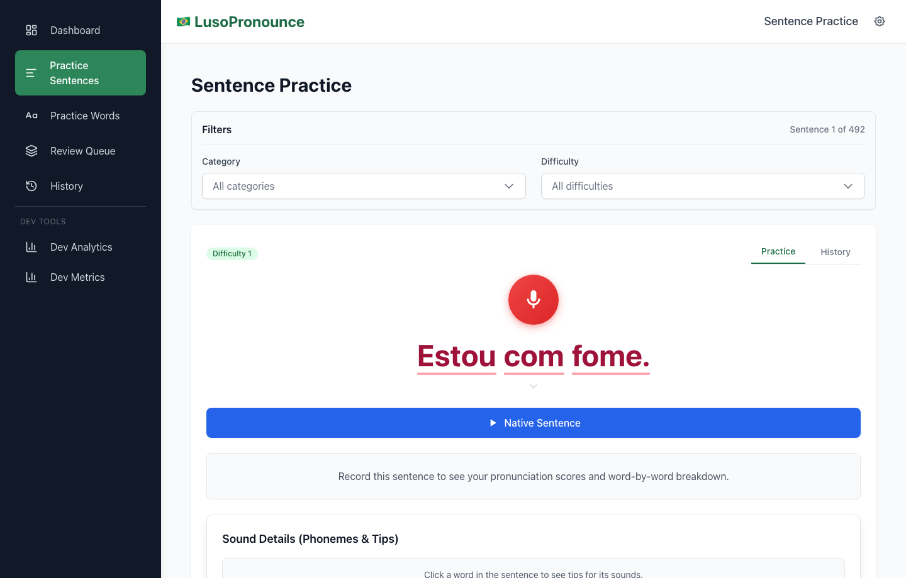
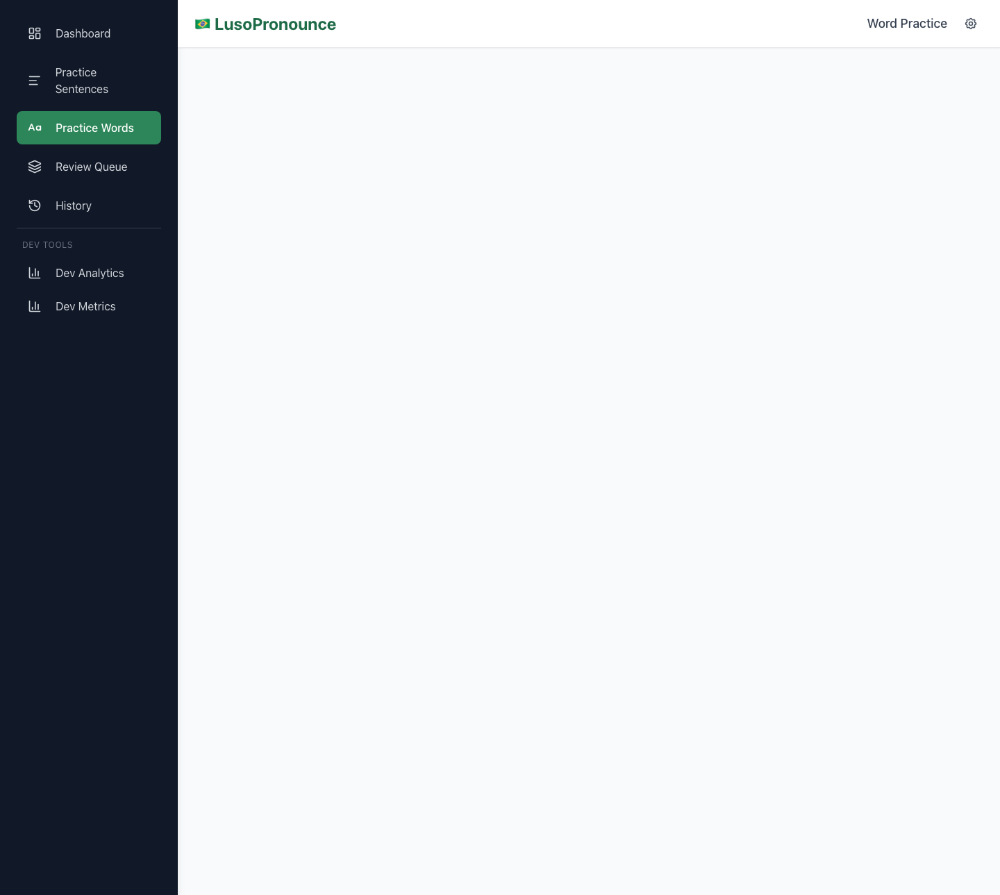
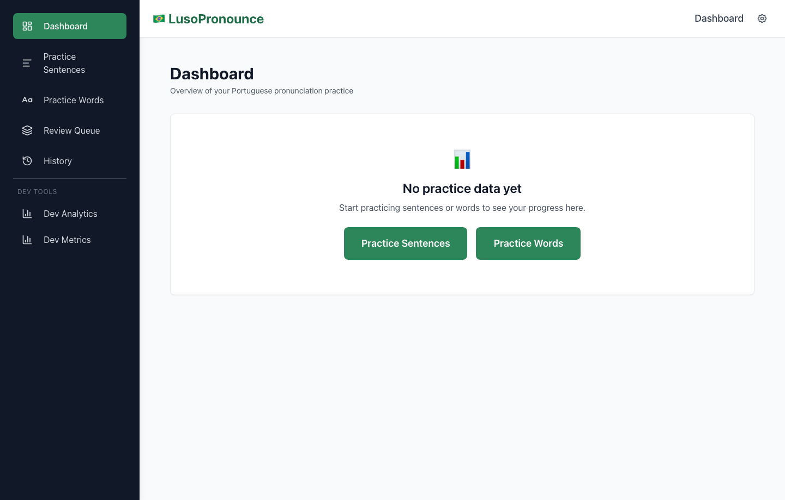
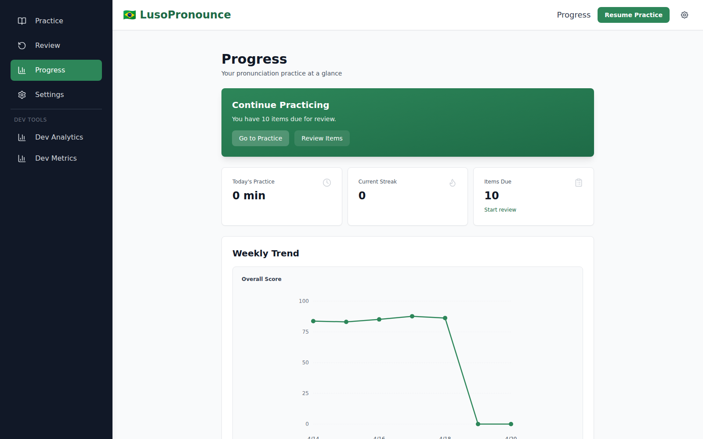
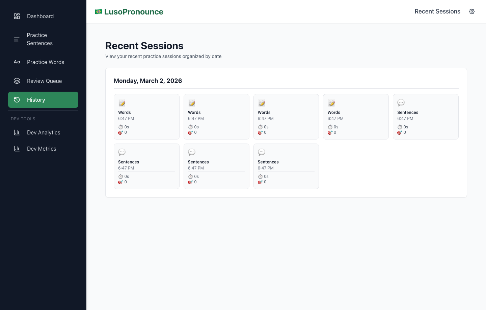
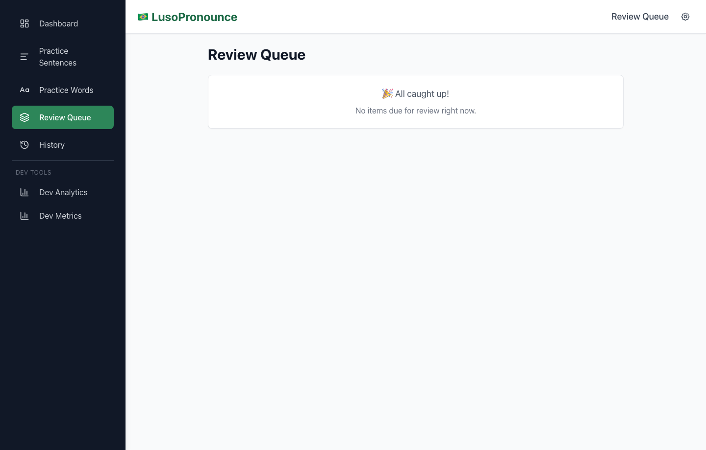
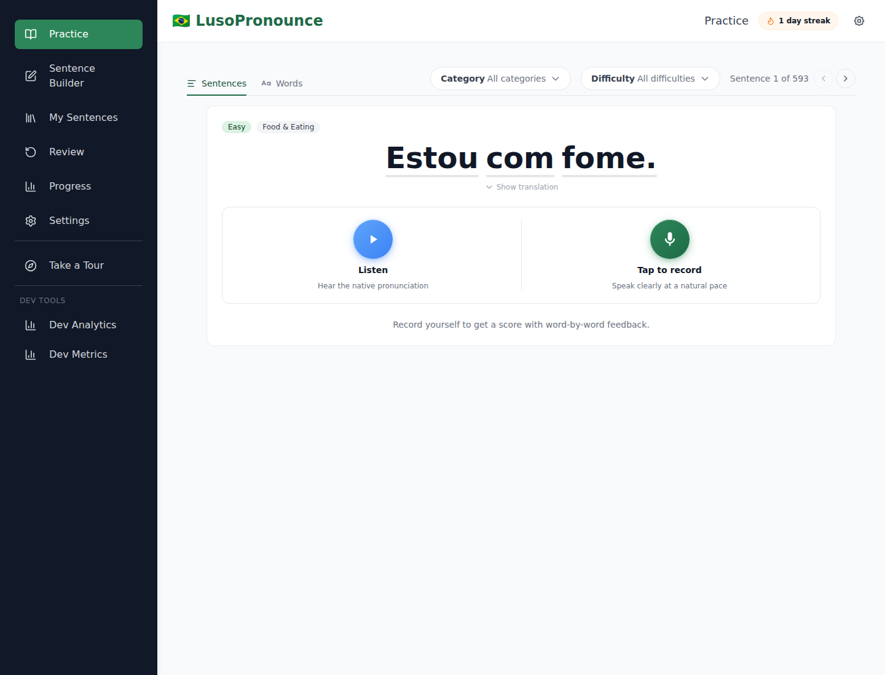
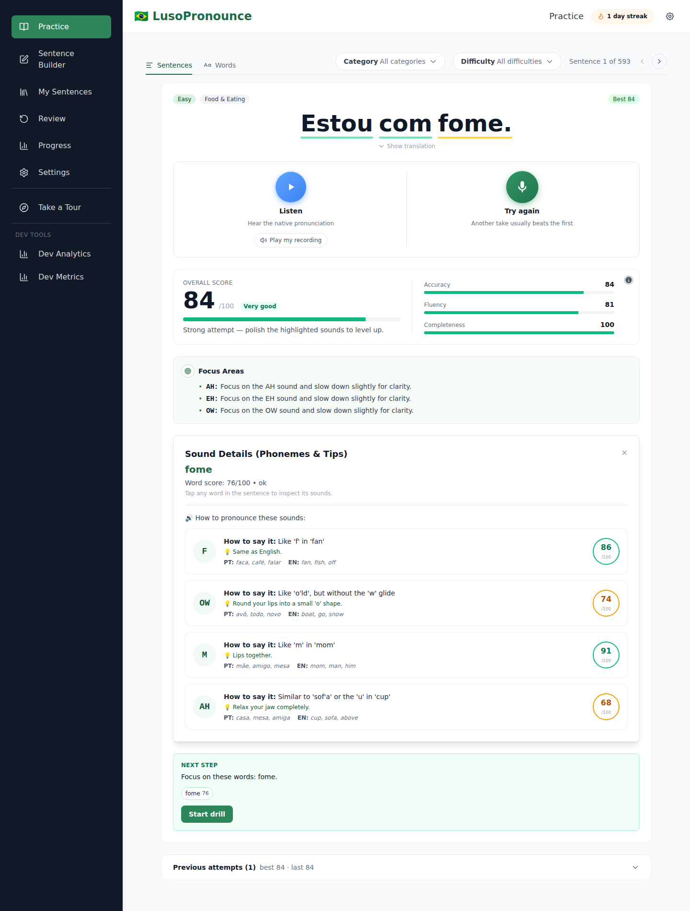

# 🇧🇷 LusoPronounce

### AI-powered Brazilian Portuguese pronunciation training using Azure Speech AI — with phoneme-level feedback, deterministic coaching, and personalized progress analytics.

 

 

<!-- TODO: Replace this static hero with a short GIF showing a full record → score → coaching cycle -->

---
**Record a sentence → get word-by-word and phoneme-level scores in seconds → drill the exact sounds you're getting wrong.**

---

## 🎮 Live Demo & Tour - [https://luso-pronunciation.vercel.app/demo]

---

## 🎯 The Problem

> **English speakers learning Brazilian Portuguese rarely get fast, phoneme-level feedback.**

Most language apps grade pronunciation at the *sentence* level — a single green checkmark or a vague "try again." That hides the sound confusions that actually matter in PT-BR:

| Confusion | Example | Why it's hard for English speakers |
|-----------|---------|------------------------------------|
| Nasal vowels | **pão**, **mãe**, **bem** | No direct English equivalent |
| `r` vs `rr` | **caro** vs **carro** | Tap vs. guttural/aspirated |
| `lh` / `nh` | **trabalho**, **ninho** | Palatalized consonants |
| `tch` / `ti` | **tia**, **noite** | Palatalization before front vowels |
| Open vs. close vowels | **avô** vs **avó** | Meaning-changing vowel height |

**LusoPronounce closes that feedback loop.** Record a sentence, get per-word *and* per-phoneme scores in seconds, then receive **deterministic, data-grounded coaching** on exactly what to drill next — including minimal-pair drills tuned to *your* confusion patterns.

---

## 💡 Why This Project Is Technically Interesting

A recruiter-skimmable tour of the engineering. Every row maps a user-facing capability to the system design behind it.

| Capability | Why It Matters | Technologies |
|------------|----------------|--------------|
| **Azure Pronunciation Assessment** | Integrates a production cloud AI service with comprehensive scoring (accuracy, fluency, completeness, miscue) — not a toy ML demo | Azure Speech SDK, `PronunciationAssessmentConfig` |
| **Phoneme-level scoring** | Parses and normalizes Azure's nested word→phoneme response into a typed UI model with IPA + error tags | TypeScript, custom result normalizer |
| **Server-side audio preprocessing** | Browser audio (webm/opus) is transcoded to the exact format Azure requires (WAV 16 kHz, 16-bit, mono) before assessment | ffmpeg-static, Express upload pipeline |
| **Real-time browser recording** | Captures microphone audio with quality gates (min duration + RMS silence detection) before spending an API call | MediaRecorder API, Web Audio analysis |
| **AI-powered coaching engine** | Deterministic, testable rules turn raw scores into prioritized next steps + minimal-pair drills | Pure TS domain logic, fully unit-tested |
| **Pronunciation analytics** | Aggregates historical attempts into trends, weak-sound detection, and improvement tracking | Custom analytics layer + chart components |
| **Custom sentence builder** | English → PT-BR translation + on-demand TTS + per-word pronunciation coverage scoring | Azure AI Translator, Azure TTS |
| **Spaced repetition (SRS)** | Server-side SM-2 scheduler links flashcard outcomes to real pronunciation scores | Custom SM-2 implementation, Mongoose |
| **Type-safe full-stack** | Shared types across client/server; strict TS (`noUnusedLocals`/`noUnusedParameters`) | TypeScript 5.9 strict mode, shared types module |
| **Fail-fast, observable backend** | Refuses to bind the port with missing config; `/api/health` reports Mongo + Azure state | Express middleware, startup checks |
| **Security hardening** | JWT auth, per-user rate limiting on AI endpoints, Helmet CSP, CORS allowlist, invite gating | jsonwebtoken, helmet, bcrypt |
| **Modern React 19 architecture** | Hook-encapsulated business logic, Context stores, lazy-loaded dev routes, responsive shell | React 19, React Router 7, Vite 7 |

 

---

## 📖 Project Overview

<table>
<tr>
<td width="50%" valign="top">

### Why pronunciation is hard
Adult learners can read and write long before they can *sound* right. Pronunciation errors become fossilized because feedback is rare, slow, and coarse-grained — a tutor can't sit with you for every sentence.

### Why phoneme-level feedback is valuable
Knowing a word was "wrong" doesn't help. Knowing *which sound* failed — and that it's the same `rr` you miss everywhere — turns vague frustration into a targeted drill.

</td>
<td width="50%" valign="top">

### How Azure evaluates pronunciation
Azure's Pronunciation Assessment compares your speech to expected phonemes and returns **accuracy**, **fluency**, **completeness**, and **miscue** signals down to the phoneme, with IPA alignment.

### How analytics + AI drive deliberate practice
Single scores are noise. Aggregating attempts over time surfaces *real* weaknesses (hardest sounds, most-retried phrases) and measurable improvement (`pão 72 → 91`), so practice stays focused on what moves the needle.

</td>
</tr>
</table>

---

## ✨ Core Features

<table>
<tr>
<td width="33%" valign="top">

### 🎙️ Live Recording & Scoring
**What:** Record a sentence or word in-browser; get accuracy, fluency, completeness & prosody back in seconds.
**Why:** Instant feedback closes the practice loop.
**How:** MediaRecorder (webm/opus) → ffmpeg WAV transcode → Azure Speech SDK.

</td>
<td width="33%" valign="top">

### 🔬 Phoneme Visualization
**What:** Expand any word for a phoneme breakdown with IPA + error tags (insertion / omission / mispronunciation).
**Why:** Shows *which sound* failed, not just the word.
**How:** Normalized Azure word→phoneme tree rendered as interactive chips.

</td>
<td width="33%" valign="top">

### 🧠 AI Coaching Engine
**What:** Actionable next-steps after each attempt + minimal-pair drills.
**Why:** Turns raw scores into a study plan.
**How:** Deterministic, fully unit-tested rules in `src/lib/coaching/`.

</td>
</tr>
<tr>
<td valign="top">

### 📈 Progress & Trends
**What:** Multi-metric trend charts (7 / 30 / 90-day / all-time), "Most Improved" & "Needs Practice" lists.
**Why:** Answers *"Am I improving?"*
**How:** Analytics layer over stored attempts + custom chart components.

</td>
<td valign="top">

### 🔊 Native Text-to-Speech
**What:** Male/female PT-BR reference audio per item, with slowed playback.
**Why:** Hear the target before you attempt it.
**How:** Pre-generated Azure TTS assets + on-demand TTS for custom sentences.

</td>
<td valign="top">

### 🗂️ Vocabulary & Phrase Practice
**What:** Pronunciation, multiple-choice (PT↔EN), listening, and self-rating modes; list / drill / weak-words views.
**Why:** Multiple modalities reinforce recall.
**How:** Mode-driven practice components over the master word corpus.

</td>
</tr>
<tr>
<td valign="top">

### ✍️ Custom Sentence Builder
**What:** Type English → get a PT-BR sentence with native audio, ready to practice.
**Why:** Practice *your* sentences, not a fixed list.
**How:** Azure AI Translator + TTS + per-word pronunciation-coverage scoring.

</td>
<td valign="top">

### 🔁 Spaced Repetition (SM-2)
**What:** Server-side flashcard scheduling tied to pronunciation outcomes.
**Why:** Reviews the right item at the right time.
**How:** Custom SM-2 (interval / ease / reps / lapses) in `flashcardService`.

</td>
<td valign="top">

### 🎯 Weakness Detection
**What:** Hardest sounds, most-mispronounced words, most-retried phrases.
**Why:** Focuses effort where it counts.
**How:** Aggregations over the `PronunciationAttempt` store.

</td>
</tr>
</table>

---

## 🏗️ Application Architecture

---

## 🔄 Pronunciation Workflow

---

## 🧬 Speech AI Pipeline

What happens internally after a user presses **Record**:

---

## 🤖 AI Features

| AI Capability | Service | Problem It Solves | Learning Benefit |
|---------------|---------|-------------------|------------------|
| **Pronunciation Assessment** | Azure AI Speech | Objective, repeatable scoring of spoken audio | Removes guesswork from "did I say it right?" |
| **Speech Recognition** | Azure AI Speech | Maps audio to recognized PT-BR text | Detects omissions, insertions, miscues |
| **Phoneme Alignment** | Azure AI Speech | Decomposes words into scored phonemes (IPA) | Pinpoints the exact failing sound |
| **Confidence Scoring** | Azure AI Speech | Accuracy / fluency / completeness signals | Suppresses unreliable tips via a trust badge |
| **Text-to-Speech** | Azure AI Speech (TTS) | Generates native male/female reference audio | Hear the target before attempting |
| **Machine Translation** | Azure AI Translator | English → Brazilian Portuguese for custom sentences | Practice your own sentences instantly |
| **Error Analysis (coaching)** | In-house deterministic engine | Converts scores into prioritized, testable advice | Targeted, hallucination-free guidance |
| **Personalized Learning** | In-house analytics | Weak-sound detection + improvement tracking | Practice adapts to your real weaknesses |

> **Design stance:** cloud AI handles *perception* (speech → scores); deterministic in-house logic handles *pedagogy* (scores → coaching). This keeps every suggestion explainable and unit-tested — no LLM hallucination in the feedback loop.

---
<!--
## 📊 Analytics Dashboard

The Progress page is organized into **Overview · Progress · Strengths · Focus Areas · Recommendations · Learning Resources**, backed by a dedicated analytics layer (`src/components/analytics/`).

| Visualization | Component | What it shows |
|---------------|-----------|---------------|
| Multi-metric trends | `MultiMetricTrendChart` | Pronunciation / accuracy / fluency / completeness over time |
| Rolling 7-day activity | `Rolling7DayChart` | Recent daily practice volume |
| Difficulty distribution | `DifficultyScoreBarChart` | Scores bucketed by difficulty level |
| Phrase trend sparklines | `PhraseTrendSparkline` | Per-sentence score trajectory |
| Improvement rows | `ImprovementRow` | "Most Improved" / "Needs More Practice" |
--> 

---

## 🛠️ Technical Highlights

<table>
<tr><td valign="top" width="50%">

**Cloud AI integration**
- 3 Azure AI services wired into a single pipeline
- Comprehensive assessment config (`EnableMiscue`, word granularity)
- Health probe reports Azure config state without burning a call

**Audio & signal processing**
- Browser `MediaRecorder` capture
- Client RMS silence + duration gates
- Server ffmpeg transcode to Azure's exact WAV spec

**Type-safe full-stack**
- Strict TypeScript (`noUnusedLocals` / `noUnusedParameters`)
- Shared types across client/server (`src/shared/types`)
- Path alias `@/*` → `src/*` across Vite/Vitest/tsc

</td><td valign="top" width="50%">

**Modern React patterns**
- React 19 + React Router 7, hook-encapsulated logic
- Context stores with localStorage dual-write resilience
- Lazy-loaded dev routes (tree-shaken in prod)

**Production-ready backend**
- Fail-fast startup on missing config / DB
- Per-user rate limiting on AI endpoints
- Helmet CSP, CORS allowlist, JWT (7-day), bcrypt

**Quality & observability**
- 48 Vitest unit/contract files + Playwright e2e in CI
- Centralized `ERROR_CLASS` taxonomy
- Latency + reliability telemetry (`p50`/`p95`)

</td></tr>
</table>

---

<!--
## 🖼️ Screenshots

### Practice Mode
| Sentence Practice | Word Practice |
|---|---|
|  |  |

### Dashboard & Analytics
| Dashboard | Progress / Trends |
|---|---|
|  |  |

### Attempt History & Review
| Recent Sessions | Review Queue |
|---|---|
|  |  |

### Before / After Pronunciation
| Before | After |
|---|---|
|  |  |
-->

---

⭐ If this project is useful or interesting, consider starring the repo.

